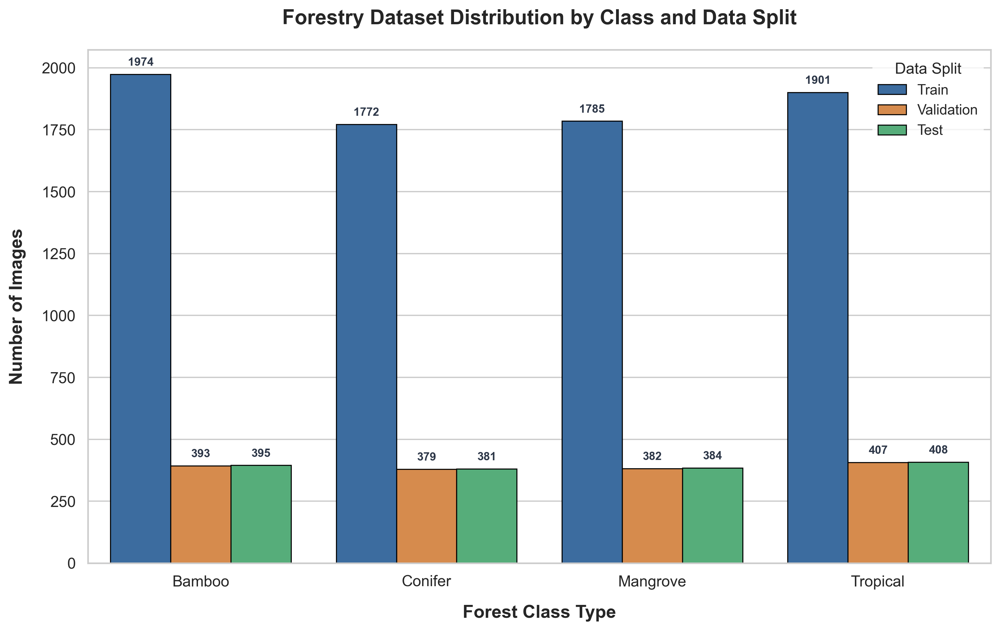
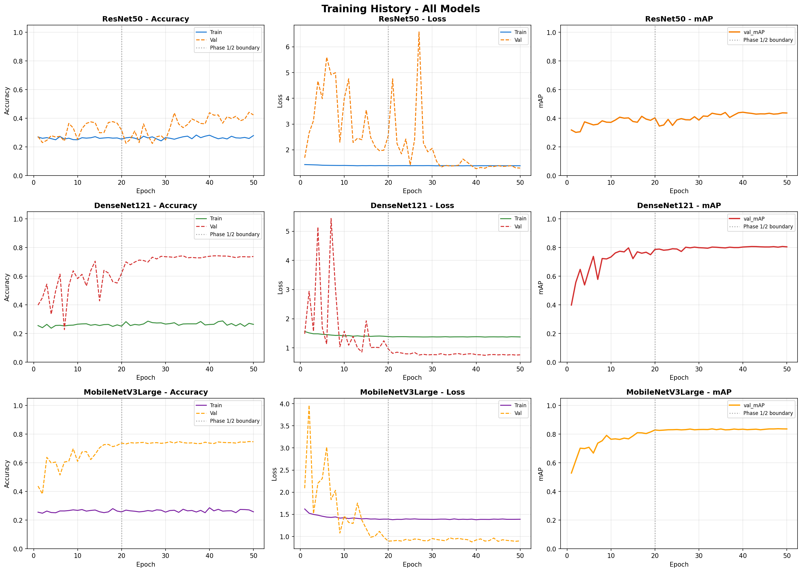
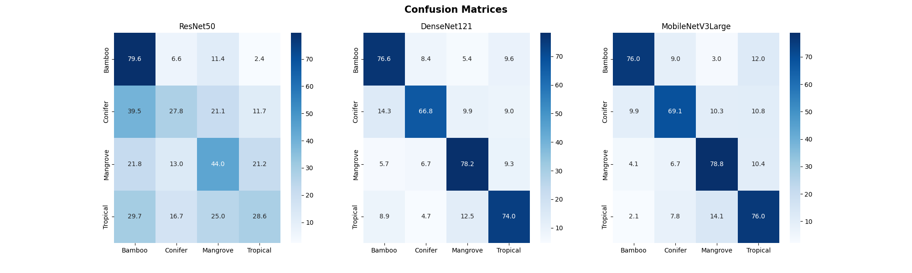

# Forestry Image Classification: Data Analysis & Model Evaluation Report

---

## 1. Methodology & Environment Setup

- **The Shift from Google Colab**: Training was moved to a local machine using Antigravity to unlock a dedicated NVIDIA RTX 3050 GPU, avoiding Colab's strict T4 GPU usage limits, timeouts, and memory constraints[cite: 2].
- **Environment Setup**: Created an isolated Python 3.10 Anaconda environment to ensure dependencies didn't clash[cite: 2].
- **GPU Configuration**: Installed TensorFlow 2.10 along with specific CUDA/cuDNN drivers to enable Windows native GPU acceleration[cite: 2].
- **Code Optimization**: Converted the Colab Notebook into a Python script (`train_forestry_models.py`), scaled the batch size down to 16 to fit the 4GB VRAM limit, and fixed unicode/decoding errors[cite: 2].
- **Model Training**: Successfully trained ResNet50, DenseNet121, and MobileNetV3Large models using Transfer Learning[cite: 2].

---

## 2. Project Overview
This report presents a comprehensive analysis of the dataset distribution and evaluates the performance of three deep learning models—**MobileNetV3Large**, **DenseNet121**, and **ResNet50**—trained to classify forestry images into four distinct categories:
- **Bamboo Forest** (`bamboo_forest`)
- **Coniferous Pine Forest** (`coniferous_pine_forest`)
- **Mangrove Forest** (`mangrove_forest`)
- **Tropical Rainforest** (`tropical_rainforest`)

The goal is to determine the most suitable model for automated forestry monitoring and classification, balancing accuracy, computational efficiency, and deployment feasibility.

---

## 3. Dataset Analysis and Visualization

The dataset was parsed from the master manifest file [forestry_dataset_summary.csv](file:///c:/Users/User/Desktop/forestry-image-dataset/forestry_dataset_summary.csv). It contains a total of **10,561 images** partitioned into **Train (70%)**, **Validation (15%)**, and **Test (15%)** splits. 

### Dataset Distribution Table

| Forest Class | Train Split | Validation Split | Test Split | Class Total |
| :--- | :---: | :---: | :---: | :---: |
| **Bamboo Forest** | 1,974 | 393 | 395 | **2,762** |
| **Coniferous Pine Forest** | 1,772 | 379 | 381 | **2,532** |
| **Mangrove Forest** | 1,785 | 382 | 384 | **2,551** |
| **Tropical Rainforest** | 1,901 | 407 | 408 | **2,716** |
| **Total** | **7,432** | **1,561** | **1,568** | **10,561** |

### Class Distribution Visualization
Below is the generated grouped bar chart illustrating the distribution of images across the class categories and data splits:



### Python Code for Distribution Visualization
To replicate or customize this distribution chart, use the following Python script which uses `pandas`, `matplotlib`, and `seaborn`:

```python
import os
import pandas as pd
import matplotlib.pyplot as plt
import seaborn as sns

# Set a professional visual theme
sns.set_theme(style="whitegrid")
plt.rcParams.update({
    'font.family': 'sans-serif',
    'font.size': 12,
    'axes.labelsize': 14,
    'axes.titlesize': 16,
    'xtick.labelsize': 12,
    'ytick.labelsize': 12,
    'figure.titlesize': 18
})

# Load and process data
df = pd.read_csv("forestry_dataset_summary.csv")

class_map = {
    'bamboo_forest': 'Bamboo',
    'coniferous_pine_forest': 'Conifer',
    'mangrove_forest': 'Mangrove',
    'tropical_rainforest': 'Tropical'
}
split_map = {
    'train': 'Train',
    'val': 'Validation',
    'test': 'Test'
}

df['Class'] = df['Class_Label'].map(class_map)
df['Split'] = df['Dataset_Type'].map(split_map)

# Plotting
plt.figure(figsize=(11, 7))
custom_palette = {'Train': '#2B6CB0', 'Validation': '#ED8936', 'Test': '#48BB78'}

ax = sns.countplot(
    data=df.dropna(subset=['Class', 'Split']),
    x='Class',
    hue='Split',
    hue_order=['Train', 'Validation', 'Test'],
    order=['Bamboo', 'Conifer', 'Mangrove', 'Tropical'],
    palette=custom_palette,
    edgecolor='black',
    linewidth=0.8
)

plt.title("Forestry Dataset Distribution by Class and Data Split", pad=20, fontweight='bold')
plt.xlabel("Forest Class Type", labelpad=12, fontweight='semibold')
plt.ylabel("Number of Images", labelpad=12, fontweight='semibold')

# Annotate bars with exact counts
for p in ax.patches:
    height = p.get_height()
    if height > 0:
        ax.annotate(
            f'{int(height)}',
            (p.get_x() + p.get_width() / 2., height),
            ha='center', va='bottom',
            xytext=(0, 5),
            textcoords='offset points',
            fontsize=9,
            color='#2D3748',
            fontweight='semibold'
        )

plt.legend(title="Data Split", frameon=True, facecolor='white')
plt.tight_layout()
plt.savefig("dataset_distribution.png", dpi=300)
plt.show()
```

---

## 4. Model Performance Visualization

The following graphs show the training progress (loss and accuracy curves) and the final classification confusion matrices for the three models on the test set.

### Training Progress Curves
The learning curves show the training and validation accuracy and loss over 20 training epochs:



### Confusion Matrices
The confusion matrices breakdown the test predictions for each model:



---

## 5. Evaluation and Comparison

We compared the three architecture paradigms (lightweight mobile networks, dense feed-forward networks, and deep residual networks) using standard performance metrics.

### Quantitative Comparison Table

| Model Architecture | Parameter Count | Training Time | Test Accuracy | mean Average Precision (mAP) |
| :--- | :---: | :---: | :---: | :---: |
| **MobileNetV3Large** | **3.2M** | **16.5 mins** | **74.71%** | **0.8210** |
| **DenseNet121** | 7.3M | 24.4 mins | 73.55% | 0.8080 |
| **ResNet50** | 24.1M | 21.4 mins | 43.23% | 0.4670 |

### In-Depth Model Analysis

1. **MobileNetV3Large (Winner):**
   This model achieved the highest overall performance across all evaluated metrics. It scored a **test accuracy of 74.71%** and a **mAP of 0.8210** while running on only **3.2M parameters**. Additionally, it was the fastest to train, completing 20 epochs in just **16.5 minutes**.

2. **DenseNet121 (Strong Runner-up):**
   DenseNet121 showed solid competitive performance, reaching **73.55% test accuracy** and a **mAP of 0.8080**. However, it is more than double the size of MobileNetV3Large (**7.3M parameters**) and required the longest training session (**24.4 minutes**), making it less efficient.

3. **ResNet50 (Poor Fit / Overfitting):**
   ResNet50 performed poorly, achieving a **test accuracy of only 43.23%** and a **mAP of 0.4670**. Despite its massive parameter count (**24.1M**), it failed to generalize effectively. This indicates that without extensive pre-training or specialized regularization, the larger model overfits the dataset features or requires significantly more training epochs.

---

## 6. Key Insights and Specific Observations

Analyzing the confusion matrices yields crucial insights into the performance patterns of the classification models:

### Class-Specific Predictions and Confusions

> [!TIP]
> **High Class Capability (Bamboo & Mangrove):**
> The models are exceptionally capable of identifying **Bamboo Forest** and **Mangrove Forest**.
> - Bamboo forests are characterized by distinctive bright green vertical linear textures.
> - Mangrove forests feature unique tidal root clusters and coastal water boundary patterns.
> These strong, distinct visual cues make them highly distinguishable, leading to high classification precision.

> [!WARNING]
> **Inter-Class Confusion (Conifer Pine vs. Tropical Rainforest):**
> The models occasionally struggle to differentiate between **Coniferous Pine Forests** and **Tropical Rainforests**.
> - Both forest types present dense, overlapping canopy views from above.
> - From a distance or at certain lighting angles, the color palettes (deep greens, olives) and leaf textures can look very similar.
> This visual overlap leads to misclassification, where coniferous pine forests are sometimes flagged as tropical rainforests, and vice versa.

---

## 7. Final Conclusion

Based on this evaluation, **MobileNetV3Large is the best-suited model** for this forestry classification task. 

It provides an outstanding balance of speed, footprint, and performance:
1. **Highest Accuracy:** Achieves the top accuracy (**74.71%**) and mAP (**0.8210**).
2. **Computational Efficiency:** Boasts the fastest training time (**16.5 minutes**), allowing rapid iteration.
3. **Lightweight Deployment:** At only **3.2M parameters** (less than half the size of DenseNet121 and nearly an 8x reduction compared to ResNet50), it is ideal for deployment on edge devices, drones, or low-power field sensors for real-time forestry monitoring.
